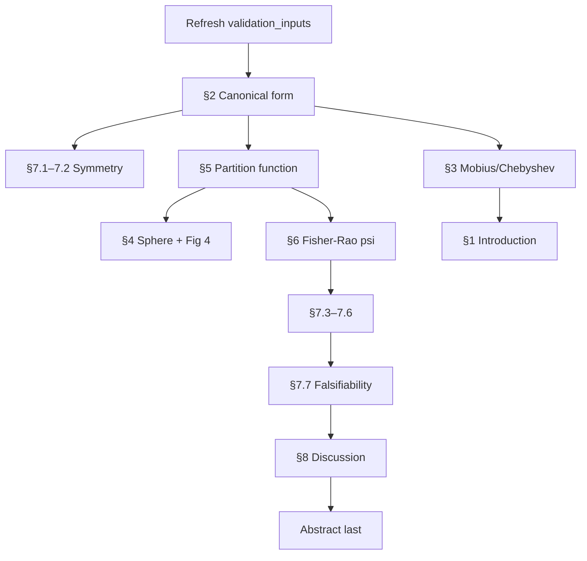
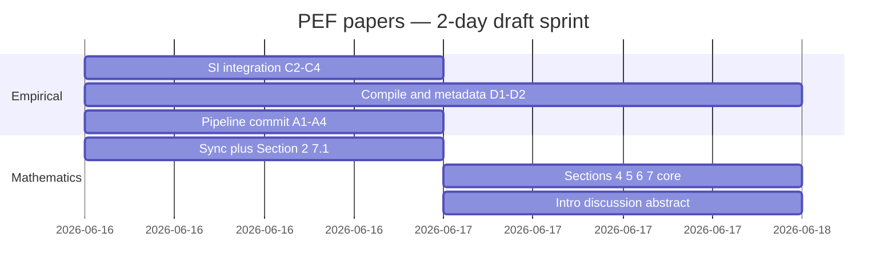

# PEF papers — dual roadmap

**Last updated:** 2026-06-22  
**Target:** complete drafts of both papers by **2026-06-17** (two days)

This file tracks the two parallel paths to submission. Tick items in Git commits or by editing status columns as work completes.

---

## Road A — Empirical paper (`pef-empirical`)

**Goal:** Submission-ready manuscript with a clean, reproducible MATLAB pipeline.

**Canonical run:**

```bash
cd scripts/paper_pipeline
/Applications/MATLAB_R2025b.app/bin/matlab -batch "run('run_paper_pipeline.m')"
/Applications/MATLAB_R2025b.app/bin/matlab -batch "run('run_pef_idealised_probit_sim.m')"
/Applications/MATLAB_R2025b.app/bin/matlab -batch "run('run_pef_finalize_diagnostics.m')"
```

### A. Reproducibility and repo

| ID | Task | Status |
|----|------|--------|
| A1 | Full pipeline + finalize + idealised sim run on clean tree | Partial |
| A2 | All `figures/Figure_*.png` paths resolve | Done |
| A3 | `numbers.tex` + `finalize_correlations.tex` match manuscript | Done |
| A4 | Commit June pipeline/SI work | Pending |
| A5 | README documents S1–S8 and three-script workflow | Done |
| A6 | `sync_to_companion.sh` after clean commit (optional pre-submit) | Stale (2026-05-21) |

### B. Manuscript ↔ pipeline consistency (blocking)

| ID | Issue | Status |
|----|-------|--------|
| B1 | Game counts: Methods/appendix use 283 / 1114 (two-season pooled), not 240 / 552 | Done |
| B2 | Study count: 113 KPI studies, not “47-study” | Done |
| B3 | ML methods: logistic `fitglm`, 5-fold CV (MATLAB), not scikit-learn trio | Done |
| B4 | η–*I* narrative: fixed-δ idealised *r* ≈ 0.87; heterogeneous KPI *r* ≈ −0.21; replace stale *r* = 0.900 | Done |
| B5 | Scenario table: idealised probit ML % (≈ 9.4, 8.2, 8.6, 7.9), not legacy 15.2 / 25.3 | Done |
| B6 | Multiple-comparison table (`tab:mc`): not pipeline-generated — soften, replace, or move to SI | Partial (caption qualified) |
| B7 | Polynomial `eq:dml_poly` coefficients 0.234 / 0.089 — consistent with pipeline | Done |
| B8 | Abstract `\PEFmlCorr` = 0.033 — honest weak mapping | Done |
| B9 | Discussion quadrant narrative; remove obsolete TODO | Done |

### C. SI and narrative integration

| ID | Task | Status |
|----|------|--------|
| C1 | Main text cites S1–S2 | Done |
| C2 | Main text cites S3–S8 (minimal Results paragraph vs SI-only) | Done — new §Efficiency–Power Alignment subsection in results.tex |
| C3 | `Figure_3b` (ψ residual): cite, defer to companion, or omit | Done — one sentence in Fig 3 caption; `brownPEFmath` stub added to references.bib |
| C4 | Supporting-domain SI figures vs prose claim | Done — prose now cites tab:validation and fig:pef_landscape only |
| C5 | Efficiency–power story wired to S4–S7 | Partial (SI captions done) |

### D. Pre-submission polish

| ID | Task | Status |
|----|------|--------|
| D1 | `latexmk -pdf` — zero undefined refs | Pending |
| D2 | Author block, affiliations, data/code statement | Pending |
| D3 | Target journal + SI format | Pending |
| D4 | Co-author sign-off on weak η→ML framing | Pending |

### Empirical sequence (recommended)

1. ~~**B1–B5** (consistency pass)~~ ✓ 2026-06-15
2. ~~**C2–C3** (SI integration decisions)~~ ✓ 2026-06-22
3. A1 + A4 (pipeline rerun + commit)
4. D-items → submit
5. A6 (companion sync when drafting §7)

---

## Road B — Mathematics companion (`pef-mathematics`)

**Goal:** Theory-first companion citing empirical CSVs in §7; empirical submits first.

**Validation inputs:** refresh from empirical via `bash scripts/paper_pipeline/sync_to_companion.sh` (run from `pef-empirical` root on a **clean** tree).

### Drafting order

| Phase | Section | File | Depends on | Status |
|-------|---------|------|------------|--------|
| 0 | Refresh inputs + companion Fig 1 plan | `validation_inputs/` | Empirical pipeline | **Done** (2026-06-22, commit 5aa9cfc) |
| 1 | §2 Canonical form + κ ↔ 1/κ | `sections/canonical_form.tex` | — | **Drafted** 2026-06-22 |
| 1b | §1 Introduction | `sections/introduction.tex` | §2 | **Drafted** 2026-06-22 |
| 2 | §7.1–7.2 Symmetry tests | `sections/numerical_validation.tex` | CSVs | **Drafted** 2026-06-22 (§7.3–7.7 pending theory) |
| 3 | §5 Partition function | `sections/partition_function.tex` | §2 | **Drafted** 2026-06-22 |
| 4 | §4 Sphere realisation + Fig 4 | `sections/sphere_realisation.tex` | §2 | **Drafted** 2026-06-22 |
| 5 | §6 Fisher–Rao ψ | `sections/fisher_rao.tex` | §5, §7.5 CSVs | **Drafted** 2026-06-22 |
| 6 | §3 Möbius / Chebyshev | `sections/mobius_chebyshev.tex` | §2 (+ literature scan) | **Drafted** 2026-06-22 |
| 7 | §7.3–7.7 Remaining validation + falsifiability table | `numerical_validation.tex` | §3–§6 | **Drafted** 2026-06-22 |
| 9 | §8 Discussion | `sections/discussion.tex` | §7.7 | **Drafted** 2026-06-22 |
| 10 | Abstract | `sections/abstract.tex` | All above | **Drafted** 2026-06-22 |



### Companion scope guardrails

- Do **not** re-derive six-domain KPI ML tables from empirical.
- §7 numbers must match `validation_inputs/` — no hand-typing.
- ψ headline interpretation lives here, not in empirical Results.

---

## Cross-links

| Empirical submits with… | Companion later cites… |
|-------------------------|------------------------|
| Distribution-free η, quadrants, weak η→ML | Canonical form, κ symmetry |
| (A1)–(A2) MI + idealised probit SI | Partition function, ρ = 0 regime |
| Sports + six-domain validation | §7 CSV tests |
| No ψ headline | ψ scale, meta-analytic pooling |

**Project memory:** [`PEF_PROJECT_MEMORY.md`](PEF_PROJECT_MEMORY.md) (both repos).

---

## Two-day plan (complete drafts by 2026-06-17)

**Definition of “complete draft”**

| Paper | Complete draft means | Realistic scope |
|-------|----------------------|-----------------|
| **Empirical** | Compiles cleanly; pipeline reproducible; main + SI internally consistent; author/metadata blocks filled; ready for your read-through before journal formatting | **Achievable** — manuscript body largely written |
| **Mathematics** | All sections have prose (not TODO scaffolds); §7 reports CSV numbers; one companion figure; abstract last | **Achievable as first full draft** — §3 Möbius may stay shorter; deep literature scan deferred |

### Day 1 — Tue 2026-06-16

| Block | Empirical (`pef-empirical`) | Mathematics (`pef-mathematics`) |
|-------|----------------------------|-----------------------------------|
| **Morning** | **C2:** Add one Results subsection (efficiency–power) cross-ref S3–S7. **C3:** One sentence on Fig 3b → companion. **C4:** Soften supporting-domain SI claim or note as table-only. | **P0:** Commit empirical work → `sync_to_companion.sh`. **§2** canonical form (full draft from outline). |
| **Afternoon** | **D1:** `latexmk` — fix undefined refs/cites. **B6:** Drop or move `tab:mc` if still uncomfortable. | **§7.1–7.2** symmetry tests (prose from `kappa_symmetry_*.csv`). **§5** partition function + cumulant identity. |
| **Evening** | **A1:** Full three-script pipeline rerun. **A4:** Git commit (pipeline + tex + figures + README). | **§7.5–7.6** ψ stabilisation + regime LRT from `psi_*.csv`. Start **§4** sphere theorem + figure sketch. |

### Day 2 — Wed 2026-06-17 (target: complete drafts)

| Block | Empirical | Mathematics |
|-------|-----------|-------------|
| **Morning** | **D2:** Author, affiliation, data/code availability statement. Read-through: abstract ↔ Results alignment (weak η→ML). | Finish **§4** sphere + **§6** ψ (meta-analytic recipe). **§7.3–7.4** cumulant + sphere numerical checks. |
| **Afternoon** | **D3:** Pick target journal; adjust SI placement if needed. Final compile + PDF review. | **§3** Möbius linearisation (core identity + iso-η contours; Chebyshev/Poisson abbreviated). **§7.7** falsifiability table. |
| **Evening** | Mark empirical **submission draft** in roadmap. Optional: send PDF to co-authors. | **§1** intro + **§8** discussion + **abstract**. Compile companion PDF. Mark both drafts complete. |

### Parallel workstreams (if solo)



### Risk buffer

| Risk | Mitigation |
|------|------------|
| Companion §3 literature scan slows Day 2 | Ship §3 as “identity + contours”; defer Chebyshev/Poisson to appendix remark |
| `tab:mc` / Cohen’s *d* numbers untrusted | Move table to SI or delete; keep bootstrap narrative |
| Pipeline rerun changes macros | Rerun **after** tex edits; commit outputs + tex together |
| Two full papers in 48 h is tight | **Priority order:** empirical submission draft first; companion “complete draft” = all sections prose, polish later |

### Checklist at end of Day 2

- [ ] Empirical PDF compiles; no `???` macros; S1–S8 present
- [ ] `pef-empirical` committed; `sync_to_companion.sh` run on that commit
- [ ] Companion PDF compiles; no `% TODO: drafting` in body sections
- [ ] `validation_inputs/_manifest.csv` matches empirical commit SHA
- [ ] Both READMEs and this roadmap statuses updated

**Repos:** [`pef-empirical`](.) (submit first) · [`pef-mathematics`](../pef-mathematics) (companion)
